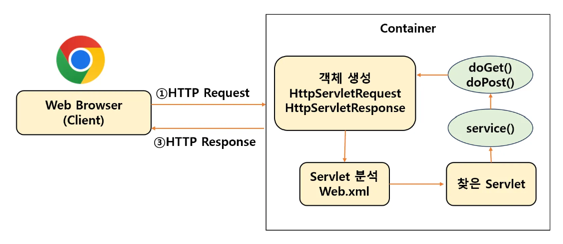
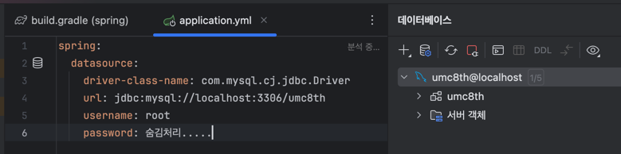

# 💡 4주차 핵심 키워드 💡
<br>

## 1. DI
### Dependency Injection

[정의]<br>직역하면 **의존성 주입**으로, 객체가 필요로 하는 의존 객체를 외부에서 주입하는 방식이다.<br>

[목적]<br>두 가지 문제점을 해결하기 위함이다.<br>
1. 두 클래스가 강하게 결합되어 있다.
2. 객체들 간의 관계가 아니라 클래스들 간의 관계가 맺어진다.
```java
public class Store {
    private Pencil pencil;
    
    public Store() {
        this.pencil = new Pencil();
    }
}
```
- 만약 Store에서 Pencil이 아니라 Note를 판매하고자 한다면?<br>
Store 클래스의 생성자에 변경이 필요하다. -> 즉, 유연성이 떨어짐.<br>
**∴ 의존성 주입을 통해 이 문제를 해결하자.**

[장점]<br>
1. 강하게 결합된 클래스들을 분리
2. 두 객체 간의 결합도를 낮춤
3. 객체의 유연성을 높임
4. 테스트 작성을 용이하게 함

[방식]<br>
1. **생성자 주입** 👍
```java
@Autowired
public StoreService(final StoreRepository storeRepository) {
    this.storeRepository = storeRepository;
}
```
- 객체가 생성될 때 필요한 의존성을 설정한다. 이는 객체의 불변성을 보장한다.
- 근본적으로 생성자는 객체가 생성될 때 필수적인 의존성들을 보장하기 때문에, 의존성이 없는 객체를 만들 수 없다.

2. setter 주입
```java
@Autowired
public void setStoreService(final StoreRepository storeRepository) {
    this.storeRepository = storeRepository;
}
```
- 런타임에 의존성을 주입하므로 의존성이 없더라도 객체 생성이 가능하다.
- 단, db에서 데이터를 접근하는 repository를 주입받지 않은 채 작동할 수 있으므로, NullPointException 에러가 발생할 수 있다는 단점 존재!

3. 필드 주입
```java
@Service
public class StoreService {
    @Autowired
    private StoreRepository storeRepository;
}
```
- 런타임에 의존성을 주입하므로 의존성이 없더라도 객체 생성이 가능하다.
- 코드가 깔끔해진다는 장점이 있지만, 필드에 직접 주입되기에 테스트 중에 의존성을 주입하는 것이 어렵다.
- 의존성 관계가 드러나지 않아 Spring 컨테이너를 헷갈리게 해서 bean들 간의 **순환 참조 문제**가 발생할 수 있다.

### 📍순환 참조 문제란?

[정의]<br>a 클래스가 b 클래스의 bean을 주입받고, b 클래스가 a 클래스의 bean을 주입받는 상황처럼, 서로 순환되어 참조할 경우 발생하는 문제.<br>

[발생 과정]<br>
1. setter 주입 & 필드 주입
- a 클래스가 b 클래스를 의존, b 클래스가 a 클래스를 의존하는 상황이더라도 로딩 시 예외가 발생하지 않는다. 문제가 되는 순간은 **해당 메소드가 호출**되었을 때이다.
- 이는 순환 참조 문제가 아니라 서로 다른 메소드가 서로 호출할 때 발생하는 순환 호출 문제이다.

2. 생성자 주입
- 로딩시점에 예외가 발생한다.
- a 클래스가 b 클래스를 의존, b 클래스가 a 클래스를 의존하는 상황이면, a 클래스의 bean을 만드는 과정에서 b 클래스의 bean이 없으니까 이를 먼저 생성한다. 이때 a 클래스의 bean을 주입하려는데 없으니까 이를 먼저 생성.
이때 b 클래스의 bean을 주입하려는데 없으니까 a 클래스의 bean을 먼저 생성... -> 무한 반복❗

[해결 방법]<br>설계 상 순환 참조 문제가 발생할 수 있는 구조 자체를 만들지 말자...

<br>

## 2. IoC
### Inversion of Control

[정의]<br>직역하면 **제어의 역전**으로, 객체의 생성과 관리를 개발자가 아닌 **Spring 프레임워크**가 담당하는 것이다. 즉, 개발자는 필요한 객체들만 선언해 두고, Spring이 알아서 적절한 객체를 주입해주는 것.<br>

[영향]<br>이를 통해 의존성 주입, 관점 지향 프로그래밍(AOP)이 가능해진다.<br>

[작동 방식]<br>
1. 객체를 class로 정의
2. Spring 설정 파일 또는 어노테이션을 통해 객체들 간의 연관성 지정
3. IoC 컨테이너가 이 정보를 바탕으로 객체들을 생성하고 필요한 곳에 주입

-> **POJO** 기반의 개발을 가능하게 한다.

### 📍POJO란?
**Plain Old Java Object**

[정의]<br>복잡한 라이브러리나 프레임워크에 의존하지 않는 순수한 자바 객체.<br>

[장점]<br>
1. 특정 환경이나 기술에 종속적이지 않아 재사용 가능
2. 확장 가능한 유연한 코드 작성
3. 코드의 복잡성 ⬇️
4. 디버깅 및 테스트에 용이
5. **객체지향적인 설계를 제한 없이 적용 가능**

<br>

## 3. 프레임워크와 API의 차이

### 📍프레임워크란?

[정의]<br>어떠한 목적을 쉽게 달성할 수 있도록 해당 목적과 관련된 코드의 뼈대를 미리 만들어둔 것.<br>
❗️**즉, Spring을 사용하면 Frame 안에 Work를 하는 것**❗️

### 📍API란?

**Application Programming Interface**
[정의]<br>2개 이상의 소프트웨어 컴포넌트 사이에서 상호작용할 수 있도록 정의된 인터페이스.<br>

### 📍차이점

이해하기 쉽게 비유를 해보자.<br>
새 집으로 이사를 해서 집을 꾸미기로 했다. 그러면 집 밖에 가구를 배치하는건.. 말이 안된다. 정해진 규격의 집 내부에 가구를 배치해야 하는 것이 당연하다.
이게 **프레임워크**.<br>
의자와 책상같은 것은 내가 직접 제작할 수 있지만, 침대와 소파같은 가구는 직접 만들기에 어렵다고 판단된다.. 그래서 주문제작을 하기로 하고 내가 원하는 사이즈르 담은 주문내역을 작성하고 업체에 부탁했다.
이게 **API**.<br>

<br>

## 4. AOP
### Aspect-Oriented Programming

[정의]<br>관점을 기준으로 묶어서 개발하는 방식.<br>
즉 어떤 기능을 구현할 때, 그 기능을 **핵심 기능**과 **부가 기능**으로 구분해 각각을 하나의 관점으로 보는 것이다.<br>
핵심 로직 사이사이에 존재하는 부가 기능(로깅, 트랜잭션 등)은 동일한 기능을 수행할 확률 ⬆️. 

**∴ 반복되는 부가 기능을 하나의 공통 로직으로 처리하도록 모듈화 해 삽입하는 방식이 AOP.**

[장점]<br>
1. 코드의 중복성 ⬇️
2. 부가 기능에 수정 및 삭제가 필요하게 되면, 한 번에 가능
3. OOP(객체 중심의 프로그래밍) 방식의 불필요한 반복 해결

<br>

## 5. 서블릿
### Servlet

[정의]<br>웹 애플리케이션에서 클라이언트의 요청을 처리하고, 그에 대한 응답을 생성하는 중요한 구성 요소.<br>
즉, 자바에서 웹 애플리케이션을 만들 때 **HTTP 요청을 처리하는 역할**을 한다.

[동작 방식]<br>

1. 클라이언트가 url 입력 -> HTTP request가 servlet container로 전송
2. servlet container는 HttpServletRequest & HttpServletResponse 객체 생성
3. web.xml을 기반으로 클라이언트가 요청한 url이 어느 servlet에 대한 요청인지 탐색
4. 해당 servlet에서 service() 메소드 호출 후 클라이어트의 GET, POST 여부에 따라 doGet(), doPost() 호출
5. 해당 메소드는 동적 페이지 생성 후 HttpServletResponse 객체에 응답 전송
6. 응답이 끝나면 HttpServletRequest & HttpServletResponse 두 객체 소멸

### 📍Servlet container란?

[정의]<br>servlet을 관리해주는 컨테이너. 이는 클라이언트의 요청을 받아주고 응답할 수 있도록 웹 서버와 socket으로 통신한다. ex) 톰캣<br>

[역할]<br>
1. 웹 서버와의 통신 지원
2. 서블릿 생명주기 관리
3. 멀티스레드 지원 및 관리
4. 선언적인 보안 관리

### 📍DispatcherServlet이란?

[정의]<br>Front Controller 패턴을 구현한 servlet으로, 모든 HTTP 요청을 받는 servlet이다. 요청은 적절한 controller로 전달하고 로직을 실행한 후 응답을 생성한다.<br>

[예제]<br>
```java
@Controller
public class PostController {
    @GetMapping("/api/post")
    public String abcd(Model model) {
        model.addAttribute(~);
        return "efgh";
    }
}
```
1. 클라이언트가 /api/post url을 요청 -> DispatcherServlet으로 전달
2. DispatcherServlet은 해당 HTTP Request를 처리할 수 있는 적합한 controller 탐색
3. controller는 요청 처리를 위해 abcd() 메서드 호출 후, 맞는 비즈니스 로직을 실행하고 결과 반환
4. 반환 결과는 ViewResolver를 통해 적절한 view로 랜더링하고, HTTP Response로 HTML이나 JSON의 형태로써 전달

[장점]<br>기존에는 모든 servlet에 대해 url 매핑을 활용하기 위해서 web.xml에 모두 등록해주어야 했지만, dispatcher servlet의 등장으로 해당 애플리케이션으로 들어오는 모든 요청을 핸들링해주고 공통 작업을 처리하면서 편리하게 이용 가능해졌다.

<br>

## 실습 - Database와 Spring 프로젝트 연결하기

