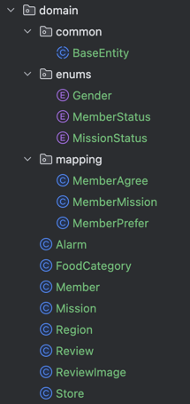

# 💡 5주차 핵심 키워드 💡
<br>

## 1. Domain

[정의]<br>해결하려는 문제 영역. 즉, 도메인 계층은 **비즈니스 규칙을 가장 정확하게 표현하는 곳**이다.<br>
예를 들어, 우리의 미션으로 생각해본다면? - **회원, 가게, 미션, 리뷰** 등이 도메인에 해당.<br>


[역할]<br>
1. 연관 관계를 나타낸다.
2. 비즈니스 모델을 표현한다.
3. 상태 전이 표현이 가능하다.

[특징]<br>
1. enum을 통해 상태나 유형 표현이 가능하다.
2. entity로 DB 테이블과 매핑되는 클래스이다.

<br>

## 2. 양방향 매핑

[정의]<br>두 엔티티가 서로를 참조하고 있는 관계.

[사용하는 경우]<br>
1. 양방향 정렬/검색 기능이 필요할 때
2. 한 쪽에서 참조 객체를 자주 조회할 때
3. 화면에서 관계를 양쪽에서 모두 보여주어야할 때

[장점]<br>
1. 조회가 편리하다.
2. 연관된 데이터의 정렬 및 필터링이 가능하다.
3. 양쪽 방향에서 데이터 접근이 가능하다.
4. 객체 그래프 탐색이 가능하다.
5. cascade의 설정이 가능하다.

[단점]<br>
1. 연관 관계의 주인을 혼동할 수 있다.
2. 무한 **순환 참조**의 위험이 있다❗️

[규칙]<br>
1. 연관 관계의 주인 (외래키 관리) : @ManyToOne
2. 연관 관계의 비주인 : @OneToMany
3. @OneToMany 생략 가능 ? : 객체 간 순환 참조 위험, 무한 루프, 관리 포인트 증가 등의 이유로 복잡도가 올라가므로 필요한 경우에만 쓰자!

```java
@ManyToOne(fetch = FetchType.LAZY)
@JoinColumn(name = "member_id")
private Member member;

---

@OneToMany(mappedBy = "member", cascade = CascadeType.ALL)
private List<MemberMission> memberMissionList = new ArrayList<>();
```

<br>

## 3. N + 1 문제

[정의]<br>데이터를 1번 조회했는데, 추가로 N번 더 쿼리가 발생하는 문제. -> 총 N+1번의 쿼리가 발생 -> 성능⬇️

```java
List<Member> members = memberRepository.findAll();
for (Member m : members) {
    System.out.println(m.getReviewList().size());
}
```
- `memberRepository.findAll()` -> 회원 전체 조회 쿼리 **1번** 발생
- `m.getReviewList()` -> **회원 수만큼** 리뷰 조회 쿼리 발생

[발생 이유]<br>⭐**지연로딩**⭐️<br>
즉, 처음에는 `Member`만 가져오고, `getReviewList()`를 호출할 때마다 리뷰를 그때그때 따로 가져온다.

[문제]<br>
1. 쿼리 수 ⬆️
2. DB에 부하 ⬆️
3. 네트워크 또는 DB 연결 오버헤드 ⬆️
4. 대량 데이터일수록 속도가 저하된다.

[해결 방법]<br>
1. fetch join : 연관된 데이터를 한 번에 가져온다.
2. EntityGraph : 특정 관계만 eager하게 가져오도록 지정한다.
3. DTO를 통한 직접 조회 : 필요한 필드만 조합하여 쿼리를 최적화한다.