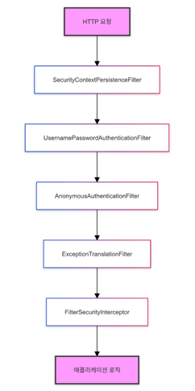

# 💡 10주차 키워드 💡
 

## 1. Spring Security

[정의] Spring 기반 애플리케이션의 보안을 담당하는 강력한 프레임워크. 이는 **인증**과 **권한 부여**를 제공.

[역할] 
1. 누가 들어오는지 확인 **(인증)**
2. 들어온 사람이 어디에 갈 수 있는지 결정 **(인가)**
3. 위험한 상황으로부터 보호 **(보안 위협 방어)**

[핵심 개념] 
1. **인증 (Authentication)**
- **너 누구야?** 를 확인하는 과정
- 예시 : 로그인할 때 이메일과 비밀번호를 입력하면, 서버가 그 정보가 맞는지 확인하는 것.

2. **인가 (Authorization)**
- **너 이거 할 수 있어?** 를 확인하는 과정
- 예시 : 일반 사용자가 관리자 전용 페이지에 접근하면, Spring Security가 막아줌.

[주요 컴포넌트] 
1. AuthenticationManager : 인증 과정을 관리하는 중심 컴포넌트
2. AuthenticationProvider : 실제로 인증 로직을 처리하는 역할
3. UserDetailsService : 사용자 정보를 불러오고 검증하는 서비스
4. SecurityContext : 인증이 완료된 사용자 정보를 저장하는 컨텍스트

[SecurityContextHolder❓] 
현재 보안 컨텍스트에 대한 세부 정보를 보관한다.

1. 인증된 사용자 정보를 SecurityContext에 저장 및 관리
2. 이후의 요청에서 SecurityContext를 통해 인증된 정보를 참조하여 사용자의 권한이나 인증 상태를 확인
3. 애플리케이션의 어디서나 `SecurityContextHolder.getContext()` 메서드를 사용해 인증 정보 접근

[Filter Chain❓] 
Spring Security에서 HTTP 요청을 처리할 때 사용하는 일련의 필터들

[주요 필터] 
1. SecurityContextPersistenceFilter
- 요청 간 SecurityContext를 유지
- 새 요청이 들어올 때 이전에 인증된 사용자 정보 복원
2. UsernamePasswordAuthenticationFilter
- 폼 기반 로그인 처리
- 사용자가 제출한 username과 password를 확인하여 인증 시도
3. AnonymousAuthenticationFilter
- 이전 필터에서 인증되지 않은 요청에 대해 익명 사용자 인증 제공
4. ExceptionTranslationFilter
- Spring Security 예외를 HTTP 응답으로 변환
- 인증 실패 시 로그인 페이지로 리다이렉트, 인가 실패 시 403 오류 반환
5. FilterSecurityInterceptor
- 접근 제어 결정을 내리는 마지막 필터
- 현재 인증된 사용자가 요청한 리소스에 접근 권한 여부 확인

[흐름] 

## 2. 인증(Authentication)과 인가(Authorization)

[인증 흐름] 
1. 사용자가 로그인을 요청
2. AuthenticationFilter : `UsernamePasswordAuthenticationFilter`가 요청을 가로채고 `Authentication` 객체 생성
3. AuthenticationManager : `AuthenticationManager`는 적절한 `AuthenticationProvider`를 선택하여 인증을 위임
4. AuthenticationProvider : 선택된 `AuthenticationProvider`는 `UserDetailsService`를 사용하여 사용자 정보 로드, 이 정보를 바탕으로 비밀번호 검증
5. UserDetailsService : 데이터베이스나 다른 저장소에서 사용자 정보 조회
6. SecurityContext : 인증 성공 -> `Authentication` 객체가 `SecurityContext`에 저장

[인가 흐름] 
1. 인증된 사용자가 보호된 리소스에 접근 시도
2. FilterSecurityInterceptor : `FilterSecurityInterceptor`가 요청을 가로채고 권한 검사 시작
3. AccessDecisionManager : `AccessDecisionManager`는 현재 사용자의 권한과 요청된 리소스의 필요 권한 비교
4. `SecurityContext`에서 현재 인증된 사용자의 권한 정보 조회
5. 사용자의 권한 충분 -> 리소스 접근 허용 || 권한 부족 -> `AccessDeniedException` 발생 + 접근 거부

## 3. 세션과 토큰

[세션❓] 
서버가 로그인한 사용자의 정보를 메모리에 저장해두고, 사용자에게는 그 정보를 찾아올 수 있는 세션 ID만 브라우저에 저장하는 방식 
사용자는 요청마다 이 세션 ID를 쿠키로 함께 전송

[장점] 
1. 서버 측에서 직접 사용자 정보를 관리하므로 보안 ⬆️
2. 세션 무효화 구현이 쉬움

[단점] 
1. 서버 메모리에 사용자 정보를 저장하므로, 사용자 수가 많아지면 메모리 부족 문제 발생
2. 서버 확장이 어려움

[토큰❓] 
사용자 정보를 암호화해서 만든 문자열(=토큰)을 클라이언트에 주고, 이후 요청마다 이 토큰을 HTTP 헤더에 담아 전송하는 방식 
대표적으로 JWT(Json Web Token)이 많이 쓰임

[장점] 
1. 서버에서 사용자 상태를 저장하지 않은 무상태(stateless) -> 서버 확장에 유리
2. 모바일 앱, 프론트/백 분리된 SPA 구조에 적합

[단점] 
1. 토큰 탈취 시 보안 위험
2. 토큰 무효화가 어려움
3. 토큰 크기가 커서 매 요청마다 네트워크에 부하가 있을 수 있음

## 4. 액세스 토큰과 리프레시 토큰

[Access Token❓] 
사용자의 인증 정보를 담은 토큰으로 API 요청할 때마다 함께 전송

[특징] 
1. 사용자의 로그인 정보를 담고 있음
2. 유효 기간이 짧음
3. 요청할 때마다 `Authorization: Bearer access token` 형태로 헤더에 넣음
4. 서버는 이 토큰을 검증하고, 사용자를 식별

[Refresh Token❓] 
Access Token이 만료됐을 때, 새로운 Access Token을 발급받기 위해 사용되는 토큰

[특징] 
1. 유효 기간이 긺
2. 주로 서버 또는 DB, Redis에 안전하게 저장
