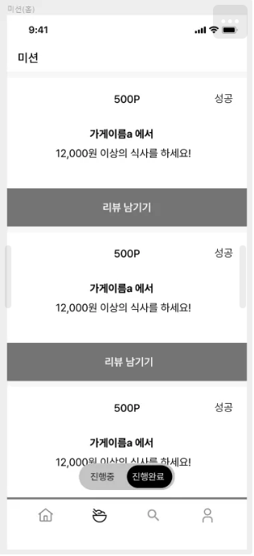
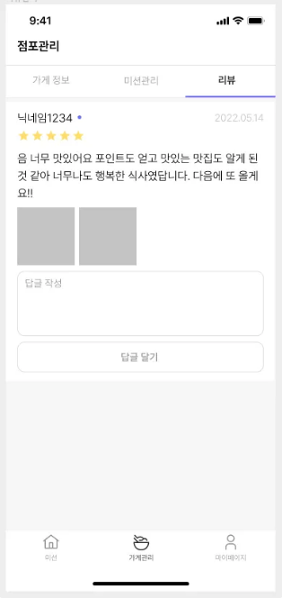
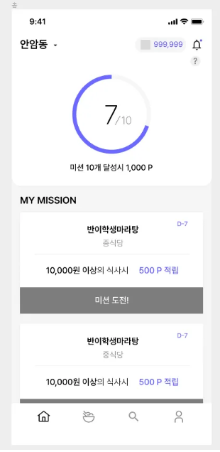
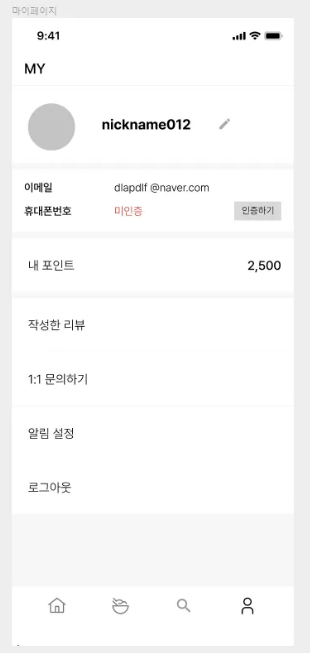

## 설계한 데이터베이스를 토대로 쿼리 작성

<br>

### 1. 내가 진행 중, 진행 완료한 미션 모아서 보는 쿼리 (페이징 포함)


```sql
-- 진행 중인 미션 --
SELECT 
    s.name,
    m.mission_body,
    m.reward
FROM
    member_mission AS mm
    INNER JOIN mission AS m ON mm.mission_id = m.id
    INNER JOIN store AS s ON m.store_id = s.id
WHERE
    mm.user_id = ?
    AND mm.status = 'IN_PROGRESS'
    AND mm.created_at < (
        SELECT created_at
        FROM mm
        WHERE mm.id = ?
    )
ORDER BY
    mm.created_at desc limit ?;

-- 진행 완료한 미션 --
SELECT
    s.name,
    m.mission_body,
    m.reward
FROM
    member_mission AS mm
    INNER JOIN mission AS m ON mm.mission_id = m.id
    INNER JOIN store AS s ON m.store_id = s.id
WHERE
    mm.member_id = ?
    AND mm.status = 'DONE'
    AND mm.created_at < (
        SELECT created_at
        FROM mm
        WHERE mm.id = ?
)
ORDER BY
    mm.created_at desc limit ?;
```

<br>

### 2. 리뷰 작성하는 쿼리 (* 사진의 경우는 일단 배제)


```sql
INSERT INTO review (
    member_id,
    store_id,
    score,
    review_body,
    created_at,
    updated_at
) VALUES (?, ?, ?, ?, NOW(), NOW())
```

<br>

### 3. 홈 화면 쿼리 (현재 선택 된 지역에서 도전이 가능한 미션 목록, 페이징 포함)


```sql
-- offset based paging 사용 --
SELECT 
    m.deadline,
    s.name,
    m.mission_body,
    m.reward
FROM
    mission AS m
    INNER JOIN member_mission AS mm ON m.id = mm.mission_id
    INNER JOIN store AS s ON m.store_id = s.id
    INNER JOIN region AS r ON s.region_id = r.id
WHERE
    r.name = '안암동'
    AND mm.member_id = ?
    AND mm.status = 'NOT STARTED'
    AND m.deadline > NOW()
ORDER BY
    deadline desc limit ? offset ?;
```

<br>

### 4. 마이 페이지 화면 쿼리


```sql
-- member 테이블에 휴대폰번호 인증여부를 나타내는 is_verified 필드 추가 --
SELECT 
    m.id, m.name, m.email, m.point,
    CASE
        WHEN  is_verified = TRUE THEN phone_num
        ELSE '미인증'
    END AS phone_num
FROM
    member AS m
WHERE
    m.id = ?
```