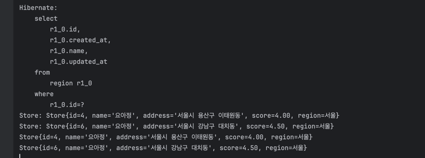

### 실습 로그 출력 사진


<br>

### 작성했던 쿼리 QueryDSL로 작성하여 리팩토링하기

0. 공통 사용
```java
QMemberMission mm = QMemberMission.memberMission;
QMission m = QMission.mission;
QStore s = QStore.store;
QRegion r = QRegion.region;
QMember mem = QMember.member;
```
<br>

1. 내가 진행중, 진행 완료한 미션 모아서 보는 쿼리
```java
// 진행중
List<Tuple> result = queryFactory
        .select(s.name, m.missionBody, m.reward)
        .from(mm)
        .join(mm.mission, m)
        .join(m.store, s)
        .where(
                mm.user.id.eq(?), // ? -> userId
                mm.status.eq(MissionStatus.IN_PROGRESS),
                mm.createdAt.lt(
                    JPAExpressions
                        .select(mm.createdAt)
                        .from(mm)
                        .where(mm.id.eq(?)) // ? -> missionId
                )
        )
        .orderBy(mm.createdAt.desc())
        .limit(?) // ? -> limit value
        .fetch();


// 진행 완료
List<Tuple> result = queryFactory
        .select(s.name, m.missionBody, m.reward)
        .from(mm)
        .join(mm.mission, m)
        .join(m.store, s)
        .where(
                mm.user.id.eq(?), // ? -> userId
                mm.status.eq(MissionStatus.DONE),
                mm.createdAt.lt(
                    JPAExpressions
                        .select(mm.createdAt)
                        .from(mm)
                        .where(mm.id.eq(?)) // ? -> missionId
                )
        )
        .orderBy(mm.createdAt.desc())
        .limit(?) // ? -> limit value
        .fetch();
```

2. 리뷰 작성하는 쿼리
```java
Review review = Review.builder()
    .member(member) 
    .store(store)  
    .score(score)
    .reviewBody(reviewBody)
    .createdAt(LocalDateTime.now())
    .updatedAt(LocalDateTime.now())
    .build();
reviewRepository.save(review);
```

3. 홈 화면 쿼리
```java
List<Tuple> result = queryFactory
    .select(
        Expressions.numberTemplate(Integer.class, "datediff({0}, NOW())", m.endDate).as("deadline"),
        s.name,
        m.missionBody,
        m.reward
    )
    .from(m)
    .leftJoin(mm).on(mm.mission.eq(m).and(mm.member.id.eq(?))) // ? -> memberId
    .join(m.store, s)
    .join(s.region, r)
    .where(
        r.name.eq("안암동"),
        mm.mission.isNull(),
        m.deadline.gt(LocalDateTime.now())
    )
    .orderBy(Expressions.numberTemplate(Integer.class, "datediff({0}, NOW())", m.endDate).desc())
    .offset(?) // ? -> offset value
    .limit(?) // ? -> limit value
    .fetch();
```

4. 마이 페이지 화면 쿼리
```java
MemberDto result = queryFactory
    .select(Projections.constructor(
        MemberInfoDto.class,
        mem.id,
        mem.name,
        mem.email,
        mem.point,
        new CaseBuilder() // 조건을 따지는 경우 : QueryDSL에서는 CaseBuilder 사용
            .when(mem.isVerified.eq(true)).then(mem.phoneNum)
            .otherwise("미인증")
    ))
    .from(mem)
    .where(mem.id.eq(?)) // ? -> memberId
    .fetchOne();


// 필요한 전제인 MemberDto
public class MemberDto {
    private Long id;
    private String name;
    private String email;
    private Integer point;
    private String phoneNum;

    public MemberDto(Long id, String name, String email, Integer point, String phoneNum) {
        this.id = id;
        this.name = name;
        this.email = email;
        this.point = point;
        this.phoneNum = phoneNum;
    }
    ...
}

```