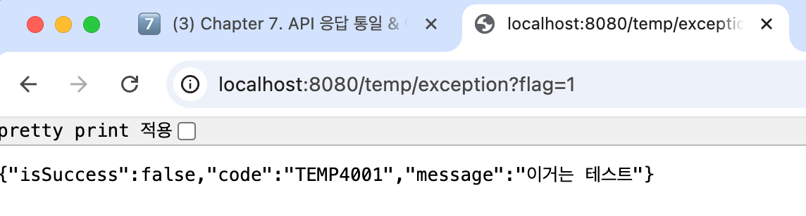
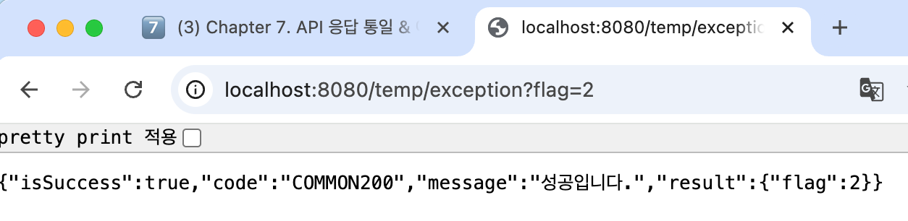

# 💡 7주차 미션 💡
 

## 1. 미션 진행 시 중간 과정 인증샷

 

## 2. RestControllerAdvice

[장점] 
1. try-catch 없이도 예외 대응 가능
2. 에러 응답을 일관되게 처리 가능
3. 모든 응답을 ApiResponse<T> 형식으로 감쌀 수 있음
4. 에러 처리 코드가 모듈화 되어 있어서 유지보수 쉬움
5. 코드가 간결해짐

**없으면 어떨까❓**
1. 컨트롤러마다 try-catch를 일일이 써야 함 -> 중복 코드 발생💢
2. 에러 응답 포맷이 일관되지 않음 -> 클라이언트가 처리하기 힘들고 예측할 수 없는 응답을 받게 됨
3. 에러 로그 관리가 어려움 -> 통합된 모니터링이 어려움
4. AOP 방식의 일관된 처리 불가 -> 관심사 분리가 깨짐

