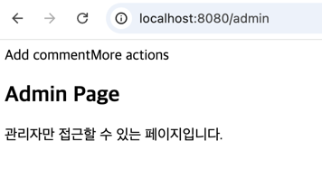

# 💡 10주차 미션 💡
 

## 1. 실습 1: Spring Security를 활용한 로그인 및 회원가입 구현 = Session 방식

- 회원가입 시 정보가 DB에 저장됨 
  (실습 2를 하면서 실습 1로 회원가입된 데이터를 지워 캡처를 못했습니다💦)
- 회원가입 후 로그인한 결과 
  
- 유저의 role을 ADMIN으로 바꾸고 로그인한 결과 
  
- 관리자 페이지 이동 
  

## 2. 실습 2: Spring Security를 활용한 로그인 및 회원가입 구현 = JWT 방식

- 회원가입 시도, 성공, DB 확인 
 
 
 
- 로그인 시도, 성공 + access token 발급 
 
 
 
- 유저 정보 조회 
